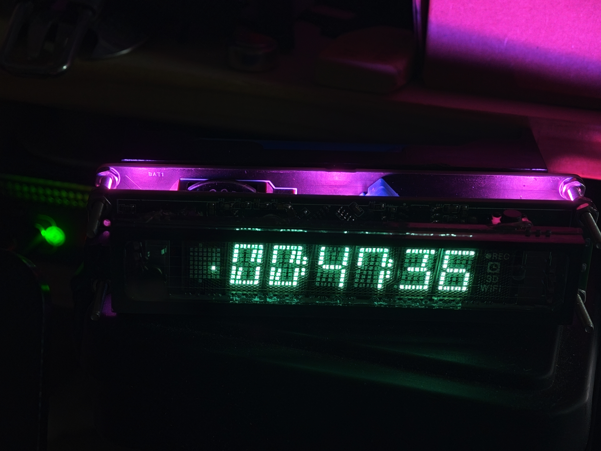

# VFD-Clock
 基于STM32F103C8T6及FreeRTOS的VFD时钟  

# 简介
 这是一个基于STM32F103C8T6及FreeRTOS的VFD时钟，采用荧光管指示时间。完全离线走时，年误差小于1分钟。   
   

# 使用指南
 1. 焊接PCB  
 2. 使用STM32CubeProgrammer烧录预编译程序  
 3. 连接USB,使用对时工具同步电脑时间  

 元器件购买请以原理图为准，BOM表可能有误  
 左右按键切换页面  
 左侧按键长按开关RGB灯，右侧按键长按切换显示亮度(7档)  

# 硬件
 1. STM32F103C8T6主控  
 2. 7-BT-317NK荧光显像管    
 3. WS2812-LED灯  
 4. 按动开关  
 5. 蜂鸣器  
 6. 开关电源  
 7. 18650锂电池  
 8. DHT11温湿度传感器  
 9. DS3231实时时钟    

# 软件
 1. VSCode EIDE  
 2. STM32CubeMX  
 3. STM32CubeProgrammer  

# 关于
 软件部分还未完全完善，欢迎提交Issue与PR  
 感谢XACT的负压Cuk电源设计  
 感谢Saisaiwa的VFD段码驱动部分代码设计  
 